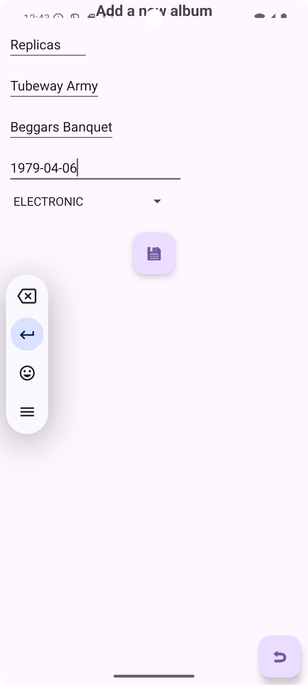

# Record Shop Android App (front-end)

This demonstration Android app was written as part of the Northcoders Java Software Development bootcamp.

## Background
The purpose of this challenge was to demonstrate the development of an Android app that provided a user with a graphical 
user interface to interact with the [backend API](https://github.com/liam-ohara/record_shop_challenge.git) 
(acting as the database) for an imaginary record shop. The high-level requirements of the API were to allow a user to:

* Store information about the records they have in stock
* Query this data in various ways
* Update it accordingly

This front-end development aimed to implement the following techniques and principles:

* Two-way data binding in Android to update underlying data from user input in the user interface
* RecyclerView class in Android with a custom AdapterView
* Model–View–ViewModel (MVVM) architectural pattern with Retrofit to call the back-end API 
* SearchView widget in Android to permit filtering within the RecyclerView

## Features
> * List all albums in stock
> * Add new albums into the back-end database
> * Update album details
> * Delete albums from the back-end database
> * Search for albums by any combination of album name, artist or release year

## Installation and Setup
### Prerequisites

* Java 21
* Gradle 
* Android Studio
* Record Shop [backend API](https://github.com/liam-ohara/record_shop_challenge.git) 

### Installation
1. Clone the repository
``git clone https://github.com/liam-ohara/record-shop-challenge-ui``

2. Open the project in Android Studio

3. Ensure that the back-end API is running locally  

4. Run the application using Android Studio device emulation

## Screenshots and use

### Initial screen
The initial view is a RecyclerView with a SearchView widget. This view displays the current albums in stock.

### Adding a new album
To add an album tap the plus icon (floating action button) next to the subheading *'Current albums in stock'*.

A second view appears with fields in which to enter the details of a new album.

Tap save icon (floating action button) when done to save the new album to the back-end database.

### Updating/amending an album
To amend an album tap the album listed in the RecyclerView.

A second view appears, the same as when adding a new album, in which the album details can be amended.

Tap save icon (floating action button) when done to save the changes to the back-end database.

### Deleting an album
To delete an album from the back-end database, tap the album listed in the RecyclerView.

Tap the delete icon (floating action button) to remove the album from the back-end database.

### Searching for an album
Search terms can be entered into the SearchView widget that will filter the albums based on
any combination of album name, artist or release year
